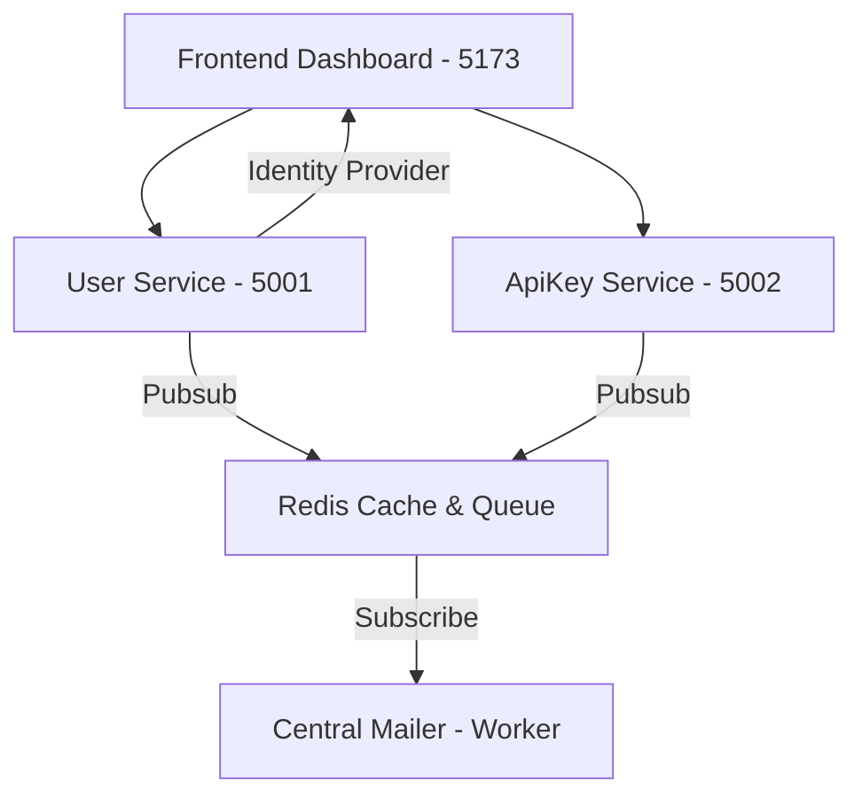

# 🔮 Secure Dashboard Microservice Ecosystem

A high-performance, production-ready microservice architecture built with **Python (Flask)** and **React (Vite/Tailwind)**. This project demonstrates centralized authentication, asynchronous background processing, and independent microservice scaling.

## 🏗️ Project Architecture



### 🛰️ Core Services
-   **User Service (Port 5001)**: The identity provider. Handles JWT issuance, OTP recovery, and user profiles.
-   **ApiKey Service (Port 5002)**: Manage external API credentials and rate limits.
-   **Mailer Service (Worker)**: An asynchronous subscriber that processes high-fidelity HTML emails.
-   **Frontend Dashboard (Vite)**: A centralized admin panel to manage the entire ecosystem.

---

## 🚀 Quick Start Guide

### 1. Prerequisites
-   Python 3.10+
-   Node.js 18+
-   Redis (Running on `localhost:6379`)

### 2. Environment Configuration
Create a `.env` file in the root directory (refer to `.env.example` if available) with your SMTP details and JWT secrets.

### 3. Startup Sequence (Separate Terminals)

**A. User Service (Identity)**
```bash
python -m user.manage runserver
```

**B. ApiKey Service (Integration)**
```bash
python -m apikey.manage runserver
```

**C. Mailer Service (Background Processor)**
```bash
python -m mailer.manage run
```

**D. Frontend (Admin Panel)**
```bash
cd frontend
npm run dev
```

---

## 🔒 Security & Performance Features
-   **Centralized JWT**: Shared secrets allow cross-service authorization via custom claims.
-   **Asynchronous Mailing**: High-fidelity templates are "hydrated" and delivered in the background to prevent blocking API responses.
-   **Rate Limiting**: Configurable RPM (Requests per Minute) per API Key.
-   **Brute-Force Protection**: Automatic account disabling after 5 failed OTP attempts.

---

## 📂 Repository Structure
-   `user/`: Flask Auth Service
-   `apikey/`: Flask Key Service
-   `mailer/`: Redis Mailer Subscriber
-   `frontend/`: React (Vite) Application
-   `.env`: Global configuration

&copy; 2026 Admin Dashboard Infrastructure
