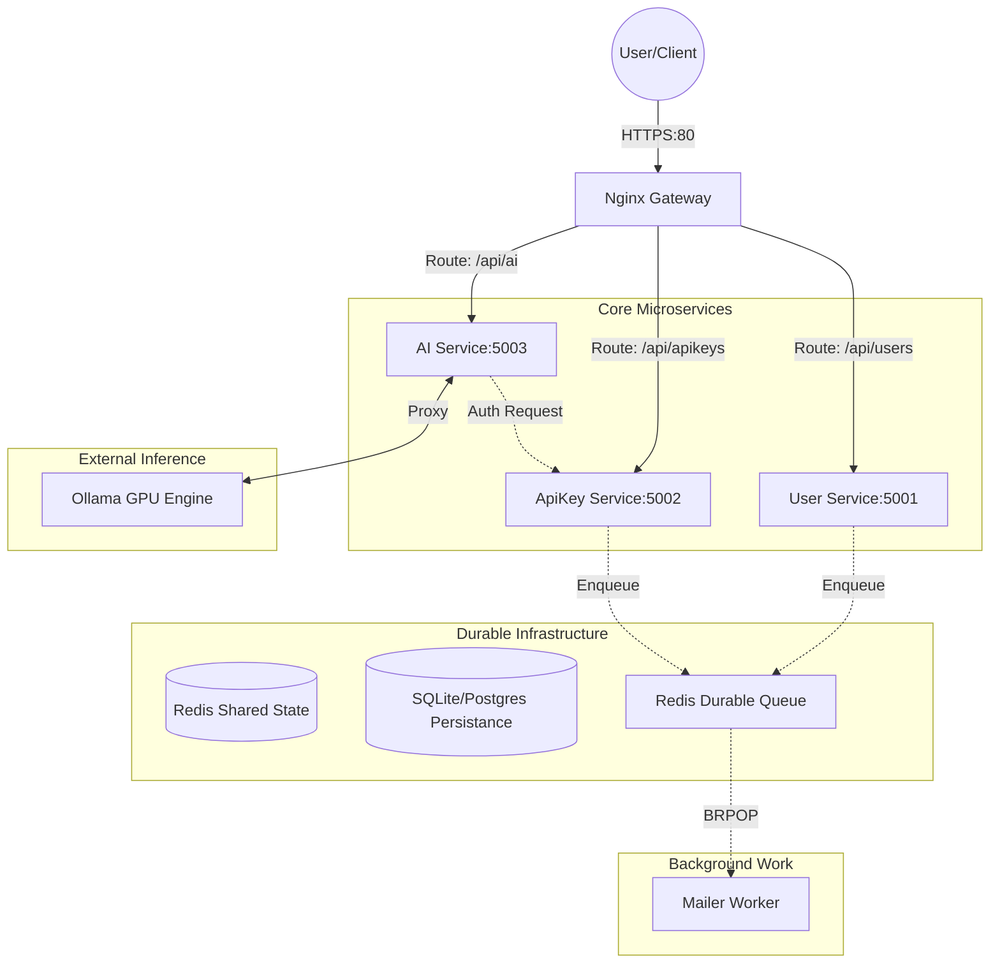

# 🌌 LLM-Orchestrator: Enterprise AI Microservice Ecosystem

[](https://opensource.org/licenses/MIT)
[](https://www.python.org/)
[](https://reactjs.org/)
[](https://redis.io/)

A production-hardened, high-performance microservice architecture designed for secure AI model orchestration, centralized identity management, and reliable background processing. This ecosystem is built to bridge the gap between volatile local prototypes and stable enterprise deployments.

---

## 🏗️ System Architecture

LLM-Orchestrator utilizes a **Gateway-First** design pattern. All traffic is funneled through an Nginx API Gateway that coordinates authentication sidecars and service discovery.



---

## 🛰️ Microservice Deep-Dive

### 1. 🛡️ Nginx API Gateway
The "Front Door" of the ecosystem.
-   **Centralized CORS**: Manages cross-origin resource sharing policy across all services.
-   **Service Proxying**: Abstract internal port complexities from the client.
-   **High-Volume Generation**: Specifically tuned with **300s timeouts** to support long-form LLM response streaming.
-   **Security**: Implements `auth_request` for the AI service, ensuring every inference call is validated against the ApiKey service before reaching the backend.

### 2. 🆔 User Service (Port 5001)
The primary identity provider (IdP).
-   **Stateless Auth**: Issues and validates JWTs for cross-service authentication.
-   **Security Lifecycle**: Handles registration, login, and profile management.
-   **Self-Healing recovery**: Integrated with the Mailer service for OTP and password reset cycles.
-   **Hardening**: Implements brute-force protection through account locking.

### 3. 🔑 ApiKey & Rate-Limiting Service (Port 5002)
The "Traffic Warden" for external integrations.
-   **Redis TTL Hardening**: Uses high-performance Redis increments with automatic TTL (60s) to prevent memory leaks while providing sub-millisecond rate-limit checks.
-   **Admin Control**: Full CRUD for API keys with configurable RPM (Requests Per Minute) limits.
-   **Auth Sidecar Support**: Exclusive endpoint for Nginx to perform low-latency header validation.

### 4. 🤖 AI Orchestration Service (Port 5003)
A Gemini-compatible proxy layer.
-   **Model Discovery**: Interfaces with external engines (Ollama, vLLM) to provide a unified `/models` list.
-   **Scalable Inference**: Proxies chat and generation completions to high-performance GPU engines.
-   **Payload Transformation**: Normalizes request/response formats across different inference providers.

### 5. 📬 Central Mailer service (Worker)
A durable background processing engine.
-   **Zero-Loss Guarantee**: Replaced volatile Pub/Sub with **Durable Redis Lists**. Messages persist even if the worker service is offline.
-   **Blocking Consumer**: Uses the `BRPOP` pattern for efficient, real-time task processing without CPU polling.
-   **Safe Shutdown**: Custom management script supports `stop` commands and PID tracking for graceful worker restarts.

---

## 🚀 Installation & Deployment

### Environment Setup
1.  **Clone the Repository**:
    ```bash
    git clone https://github.com/msivanesan/LLM-Orchestrator.git
    cd LLM-Orchestrator
    ```
2.  **Configure Environment**:
    Create a root `.env` file from the provided template:
    ```env
    REDIS_URL=redis://localhost:6379
    DATABASE_URL=sqlite:///database.db
    AI_ENGINE_URL=http://your-gpu-server/ai
    SMTP_SERVER=smtp.gmail.com
    # ... see .env.example for details
    ```

### Startup Sequence
For best results, start services in the following order:

1.  **Infrastructure**: Ensure Redis and your Database are running.
2.  **User Service**: `python -m user.manage runserver`
3.  **ApiKey Service**: `python -m apikey.manage runserver`
4.  **AI Service**: `python -m ai.manage runserver`
5.  **Mailer Worker**: `python -m mailer.manage runserver`
6.  **Nginx**: Reload configuration with `nginx -s reload`.
7.  **Frontend**: `cd frontend && npm run dev`

---

## 🔒 Reliability & Hardening Details

### Durable Task Queue
We migrated from simple Pub/Sub to a **Durable Redis Queue**. This means if the Mailer service crashes during a high-load event, no OTPs or notifications are lost. They sit safely in Redis until a new worker process consumes them.

### Rate-Limit Memory Safety
Previous versions faced memory growth issues in Redis due to persistent rate-limit keys. The system now uses atomic `INCR` + `EXPIRE` commands, ensuring Redis remains lean and fast indefinitely.

### AI Gateway Stability
To support "slow" completions common in LLMs, the Nginx gateway is explicitly tuned for long-lived connections, preventing premature disconnects during deep-thinking generations.

---

## 📂 Project Structure
```text
.
├── ai/             # AI Orchestration Service (Flask)
├── apikey/         # API Key & Rate Limit Service (Flask)
├── user/           # Identity & Profile Service (Flask)
├── mailer/         # Durable Email Worker (Worker)
├── nginx/          # API Gateway Configuration
├── frontend/       # React (Vite) Admin Dashboard
└── .env            # Centralized Configuration
```

---

&copy; 2026 LLM Orchestration Infrastructure | Designed for Stability, Built for Scale.
